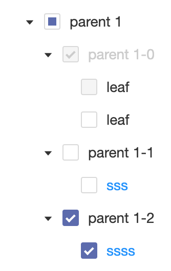

import { Meta, Story, Preview, Props } from '@storybook/addon-docs/blocks';
import PropsPanels from './PropsPanels';
import MLTreeSelect from '../src/MLTreeSelect';

# MLTreeSelect

[Ant Documentation](https://3x.ant.design/components/tree-select)

There's nothing here yet.


# MLTreeSelect.MLTreeNode

Here's some example documentation

- with
- a
- list

```javascript
if (isAwesome){
  return true
}
```

example image:



<PropsPanels of={[
  MLTreeSelect,
  MLTreeSelect.MLTreeNode,
]} />
